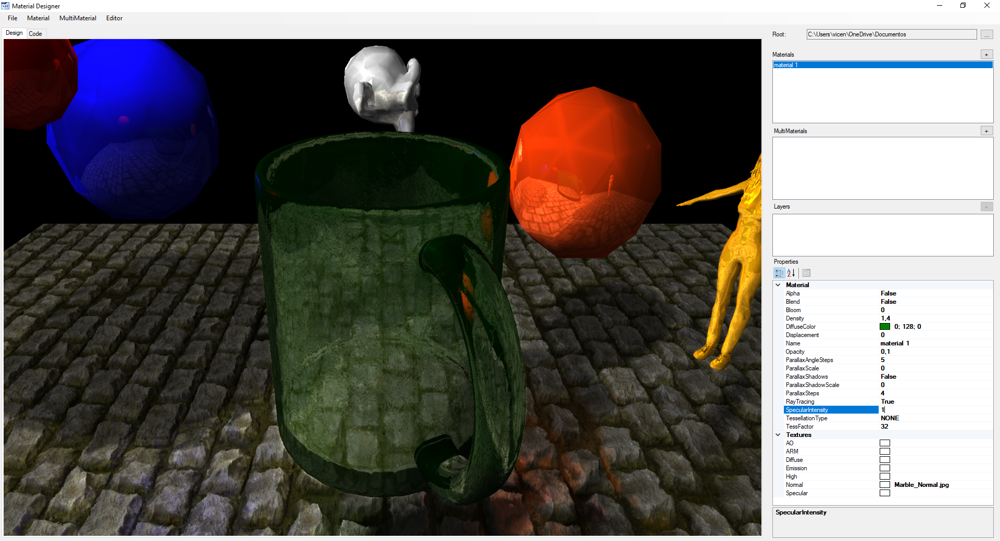
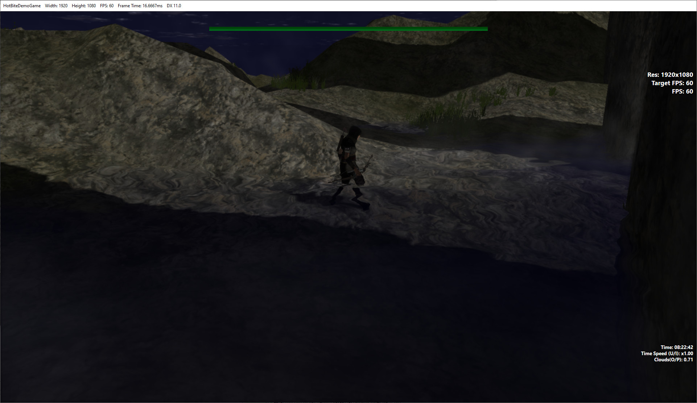

# HotBiteEngine
The HotBite Game Engine is designed to provide a powerful and flexible framework for game development. With its MIT license, The HotBite Engine is free to use, modify, and distribute, making it accessible to developers of all levels.

Engine features:

- C++/DirectX-11
- RAY TRACING!
- Material Editor
- UI Editor
- Based on Entity-Component-System architecture design
- Network multiplayer lockstep client and server
- Custom cache friendly data structures
- PBR texture render and blending
- Particle System
- Deferred lighting
- Multithread real time scheduler tasks
- Event management
- Shadow casting
- 2D GUI
- Step parallax mapping with binary search and LOD
- Static and dynamic tesellation, mesh interpolation
- Alpha blending
- Mesh displacement mapping
- Material and Mesh normal mapping
- Specular mapping
- Emission textures
- Multipass rendering
- Visual effects: like Water and Lava
- Directional lights and point lights, specular lighting.
- Volumetric directional and point lights
- Bones, Skinning and animations, blending of animations
- Environment: Sky system with real datetime day/night, celestial sky and procedural clouds.
- Post processing chain, like depth of field, Bloom, Motion Blur…
- Fbx loading
- 3D Audio
- Pathfinding: A*
…

## Screenshots examples
### Ray tracing

### Material Editor

### Motion Blur

### Parallax texture with projected shadow

Note how the projected shadow follows the parallax texture 3d effect.

### Parallax texture self-projected shadow (disable vs enabled)

Note how every light (point and directional) generates self shadow casts in the parallax textures.

### Volumetric light

Sun is configured with volumetric density based on the camera angle in the demo.

### Particle system

Fire, smoke and sparks particles are generated in the example demo.

### Fog and water multipass render effect

Water effect shows how multipass render is used to generate the water distorion effect.

### Procedural clouds and night sky

Clouds are generated procedurally in the sky component and project shadow in the scene. Demo allows change the cloud density and the time of the sky.

# Compilation:

## Dependencies:

### React3d Physics engine (https://github.com/DanielChappuis/reactphysics3d)
- Open folder with visual studio 2022 and compile Debug and Release version using cmake.

### Enet (https://github.com/lsalzman/enet)
- Open folder with visual studio 2022 and compile Debug and Release version using cmake.

## Engine:
### HotBite Engine:
- Open project solution located at ./Solution/HotBiteEngine.sln and compile Engine

### DemoGame
- Compile DemoGame in the same solution. Press play to execute it and enjoy the demo.
Use U/I and O/P keys to play with the sky component and adjust daytime and cloud density.

# Usage
There is no documentation at this moment about the engine, it will come. 
The demo game shows how to use the engine and makes use of most of the features of the engine. Check the source code and the comments of the demo and the engine itself.
Note that some modules are implemented directly in the header file (.h) to allow easy reading for educational purposes. 
The player does nothing when attacking enemies so it's a good exercise to add this behaviour to the player and see how it works.

## The game demo
Here a small video of the game demo included in the engine showing most of the features used:

https://www.youtube.com/watch?v=l186BhOkz1A&list=PLqLQI8-PKvbv1rFbgl-D0gZPfVsZkwFXF&index=19

Check more demo videos of the engine here: https://www.youtube.com/watch?v=GbQFh6jmFHw&list=PLqLQI8-PKvbv1rFbgl-D0gZPfVsZkwFXF

# License
HotBite Game Engine is developed under MIT license. 

# Author
Vicente Sirvent
vicentesirvent@gmail.com

## Third-Party Code and Assets
This project incorporates code and assets from third parties, which are subject to their respective licenses and copyright holders. The use of these resources is done in accordance with the terms specified by the original creators, and their ownership remains with them.

## Disclaimer
While utmost care has been taken to ensure compliance with licenses and proper attribution, if you believe that any third-party code or assets have been used improperly or without appropriate acknowledgment, please contact us immediately. We are committed to addressing any concerns and resolving any potential issues in a timely manner.

## License Acknowledgement
### ReactPhysics3D (License: MIT License)

Description: ReactPhysics3D is a physics engine library for 3D simulations and games.
Author(s): Daniel Chappuis
License Details: The MIT License is included in the source code repository.

### ENet (License: ENet License)

Description: ENet is a reliable UDP networking library for multiplayer games.
Author(s): Lee Salzman and the ENet contributors
License Details: The ENet License is included in the source code repository.

### FBX SDK 2020 (License: Autodesk FBX SDK License)

Description: FBX SDK is a library for reading, writing, and manipulating FBX files, a 3D file format.
Author(s): Autodesk, Inc.
License Details: (https://www.autodesk.com/developer-network/platform-technologies/fbx-sdk-2020-0)

## Reporting Copyright Infringement
If you believe that this project infringes upon your copyright or that of a third party, please contact us with the following information:

- Your full name and contact information.
- A detailed description of the copyrighted work in question.
- Proof of your ownership or authority to act on behalf of the copyright holder.
- The specific location(s) within the project where the infringement is alleged to have occurred.
- Any additional information or documentation that supports your claim.

We take copyright infringement seriously and will promptly investigate and address any legitimate concerns.
